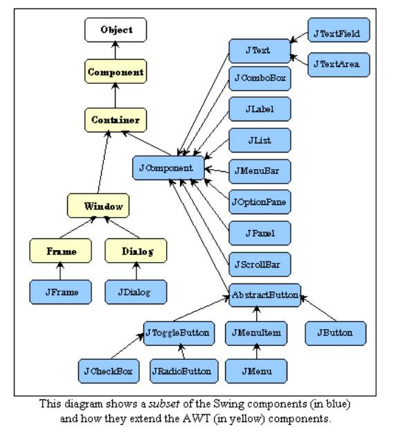

smunir2001@gmail.com | Java Swing Tutorial | April 29th, 2023
# Java Swing
## Introduction to Java
Swing is a GUI widget to toolkit created for Java based applications.
* it is a lightweight toolkit.
* it is a part of the Java Foundation Classes (JFC) and includes several packages for developing rich desktop applications in Java.
## History of Java Swing
### AWT (Abstract Window Toolkit) - 1995
* Platform specific
* Java's original toolkit for GUI.
* Heavyweight
### Swing - 1998
* Platform independent
* Was built on top of the AWT package.
* Used for building rich desktop applications and websites.
* Swing is no longer updated by Oracle, just bug fixes and maintenance.
### JavaFX - 2008
* Used for building applications for desktops, websites, and handheld devices.
* Includes features for touch-screen based devices.
## Java Swing - Class Hierarchy
